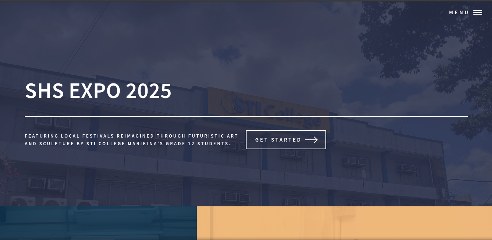
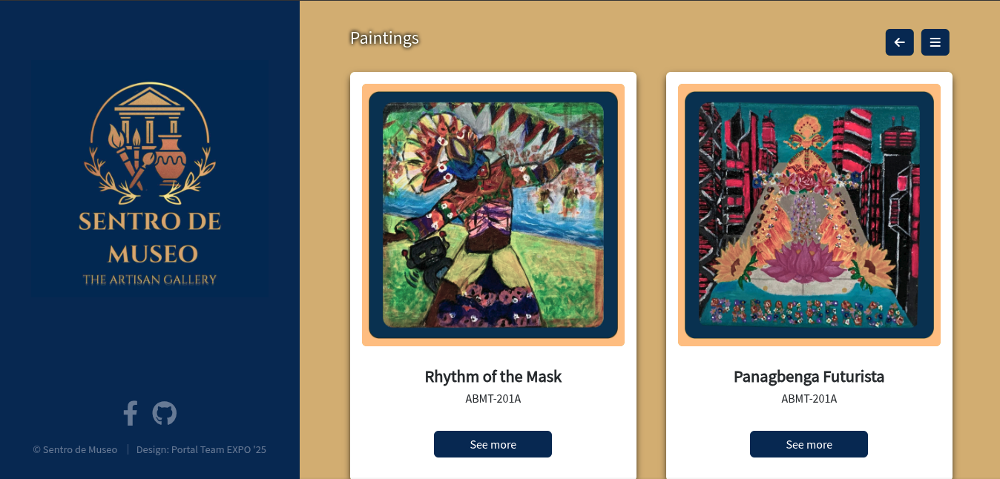

# Sentro de Museo: An Artisan Gallery

<div align="center"><a href="https://stim2025expo.netlify.app/"><br><i>stim2025expo.netlify.app/</i></a></div>

## 📌 About

**Sentro de Museo** is a web-based portal system originally developed for **STI Marikina's Senior High School Expo 2025**, titled **"Sentro de Museo: An Artisan Gallery."**

The system was designed to serve as the event's digital portal, providing an online space for presenting information, content, and resources related to the expo.

## ✨ Key Features

- **Event Portal** - Provides a centralized online portal for the Sentro de Museo expo.
- **Content Management System** -  Uses a CMS-powered content structure for managing website information and resources.
- **Responsive Interface** - Designed to provide an accessible experience across different screen sizes and devices.
- **Dynamic Content** - Uses Eleventy and structured content to generate and organize pages.
- **Static Site Deployment** -
Deployed through Netlify for fast and accessible web hosting.

## 🔄 How It Works
1. Website content is managed through the project's content structure and CMS.
2. **Eleventy** processes the source files and templates.
3. The project generates the corresponding static website.
4. The generated site is deployed through **Netlify**.
5. Visitors access the published expo portal through the web.

## 🛠️ Technologies & Services

### Core
- HTML5
- CSS3
- JavaScript
- Nunjucks

### Libraries & Frameworks
- Bootstrap
- jQuery
- MobX
- Font Awesome

### Content Management
- Decap CMS (formerly Netlify CMS)

### Build & Deployment
- Eleventy
- Netlify

### External Services
- jsDelivr
- unpkg

### Web & Security
- HSTS

### 🖥️ Preview




## 🚀 Getting Started

### 1. Clone the Repository  
Use Git to clone this project to your computer:

```bash
git clone https://github.com/godsentsalvaloza/Portal-Expo-25
```

### 2. Navigate to the Project Folder
Go to the folder where the project is cloned
```bash
cd Portal-Expo-25
```

### 3. Install Dependencies
Make sure you have Node.js installed. Then, install the required packages:
```bash
npm install
```

### 4. Start the Server
Run the app:
```bash
npm start
```

## 📁 Project Structure
```
Sentro-de-Museo/
├── public/             # Public/static assets
├── source/             # Website source files
├── .eleventy.js        # Eleventy configuration
├── package.json        # Project metadata and dependencies
└── README.md           # Project documentation
```

## The Development Team
- **Godsent John Salvaloza** - Project Manager
- **Jenna Serrano** - Frontend Developer
- **Aneeza Castro** - Frontend Developer
- **Jae Colesio** - Frontend Developer
- **Elmer James Condesa** - Frontend Developer
- **Rafael Louise Cortes** - Backend Developer 
- **Prince Benedict Villegas** - Backend Developer
- **John Micheal Casin** - Backend Developer
- **Nhiel John Piza** - Backend Developer
- **Vasili Cristino** - Backend Developer
